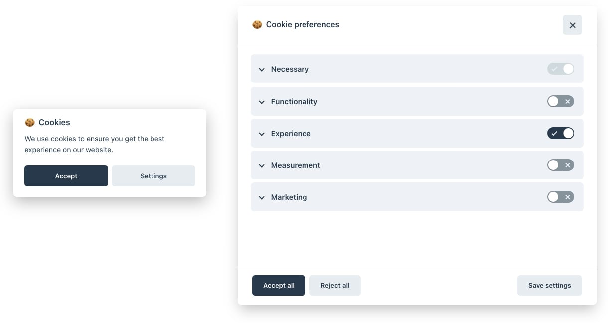

# Kirby 3 Cookieconsent plugin



A plugin to implement [cookieconsent](https://github.com/orestbida/cookieconsent) into Kirby 3.

- Uses the open-source library cookieconsent
- Provides two default configurations to quickly get you started
- Provides multiple "blocks" for various cookies
- Multilingual
- Fully customizable

## Installation

### Download

Download and copy this repository to `/site/plugins/cookieconsent`.

### Git submodule

```
git submodule add https://github.com/zephir/kirby-cookieconsent.git site/plugins/cookieconsent
```

### Composer

```
composer require zephir/cookieconsent
```

## Setup

After installation you are ready to go. By default the plugin shows the `simple` type with only accept/reject buttons and consent for Necessary and Measurement cookies.

## Options

| Option       | Type    | Default   | Description                                                                                                                                                       |
| ------------ | ------- | --------- | ----------------------------------------------------------------------------------------------------------------------------------------------------------------- |
| type         | string  | `simple`  | The pre-configured plugin type. Either use "simple", "customizable" or `null`/`false`. See "types" for more information.                                          |
| activeBlocks | array   | see below | Define which blocks are active, see "blocks" for more information.                                                                                                |
| override     | array   | `[]`      | Override the "simple" / "customizable" configuration or provide your own if "null" is given as "type".                                                            |
| content      | array   | see below | The labels that are used in the "simple" / "customizable" type if you don't use a multilingual setup. These are irrelevant if you provide your own configuration. |
| cdn          | boolean | false     | Wether to use the CDN resources of cookieconsent or host your own (the plugin provides the compiled assets automatically).                                        |

You can set all [cookieconset](https://github.com/orestbida/cookieconsent) options through the `override` array.

### Defaults

```php
[
    'type' => 'simple',
    'activeBlocks' => [
        'necessary' => true,
        'functionality' => false,
        'experience' => false,
        'measurement' => true,
        'marketing' => false
    ],
    'override' => [],
    'content' => $languages['de'],
    'cdn' => false
]
```

## Default cookie blocks

With blocks you can granularly configure which scripts to load and which not.
See [cookieconset](https://github.com/orestbida/cookieconsent) for more informations.

Default blocks provided by this plugin:

| Name          | Enabled | Description                                                                                                                                 |
| ------------- | ------- | ------------------------------------------------------------------------------------------------------------------------------------------- |
| necessary     | ✅      | The necessary cookies, can't be disabled by the user.                                                                                       |
| functionality | ❌      | Cookies for basic functionality and communication.                                                                                          |
| experience    | ❌      | These cookies help us to improve the quality of your user experience and enable interactions with external content, networks and platforms. |
| measurement   | ✅      | These cookies help us to measure traffic and analyze your behavior to improve our service.                                                  |
| marketing     | ❌      | These cookies help us to deliver personalized ads or marketing content to you, and to measure their performance.                            |

> In this context "Enabled" means that the cookie block will be available on the website (and toggable by the user if not necessary / in "simple" mode).

To enable/disable the blocks use the `activeBlocks` options array.

You can then use these blocks to enable scripts if consent was given:

```js
<script type="text/plain" data-cookiecategory="necessary">
  console.log('Necessary scripts enabled');
</script>
```

See [cookieconsent#how-to-blockmanage-scripts](https://github.com/orestbida/cookieconsent#how-to-blockmanage-scripts) for more informations.

## License

MIT

## Credits

- [Zephir](https://zephir.ch)
- [Marc Stampfli](https://github.com/themaaarc)
